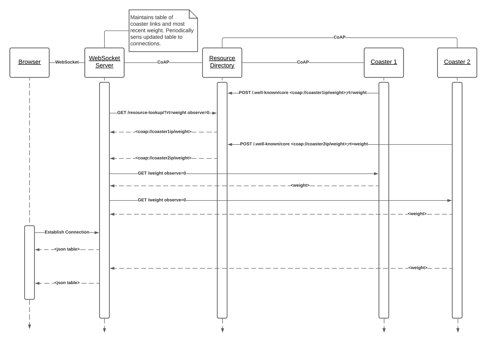

# IoT Project 3

## CoAP Server

The server requires the development version of aiocoap and a port of tatobari/hx711py to Python 3.
Remember that the resource directory must run on the well-known CoAP port so choose a different port for the CoAP server.
The server returns [CBOR](https://cbor.io) data.

```
git clone https://github.com/chrysn/aiocoap
cd aiocoap
pip3 install --user .
cd ..
cd hx711py
pip3 install --user .
cd ..
pip3 install --user cbor2
chmod +x server.py
./server.py -h  # look at the extra options
./server.py --dout X --pd_sck Y  --port PORT  # GPIO pins X, Y
```

To test the server

```
pip3 install --user pygments
pip3 install --user termcolor
aiocoap-client --observe --pretty-print coap://localhost:PORT/weight
```

To tare the load cell

```
aiocoap-client -m POST coap://localhost:PORT/weight
```

## Resource Directory

Going to use aiocoap's implementation.
Details: [CoRE Resource Directory](https://tools.ietf.org/html/draft-ietf-core-resource-directory-25).
Note: This is hardcoded to run on the well-known CoAP port.

```
aiocoap-rd
```

To test the RD (once CoAP server has registered)

```
aiocoap-client coap://localhost/resource-lookup/?rt=weight
```

## WebSocket Server

WebSocket server can query the Resource Directory for coasters weight resources and their title

```
aiocoap-client coap://localhost/resource-lookup/?rt=weight
# example output: <coap://[::1]:5686/weight>;rt="load weight";obs;title="brady";anchor="coap://[::1]:5686"
```

## UI

When we get to the UI, [cbor-js](https://github.com/paroga/cbor-js) can decode CBOR data sent from the WebSocket server.

## Sequence Diagram

Note: This is a slight simplification. The registration process begins with a GET /.well-known/core to the RD, then the server chooses to POST to /resourcedirectory because its Resource-Type is core.rd


